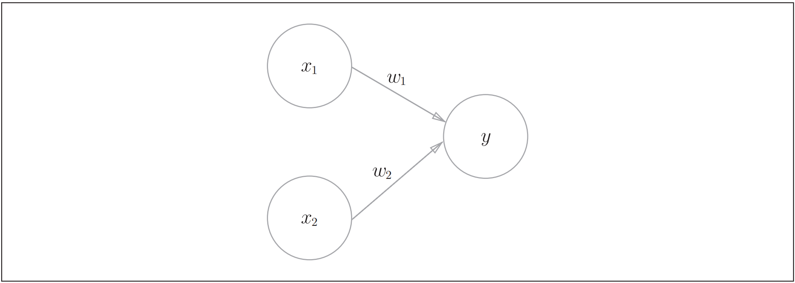
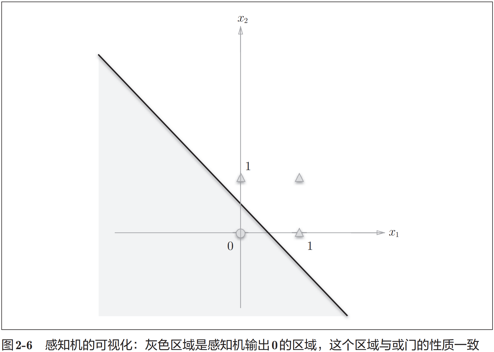
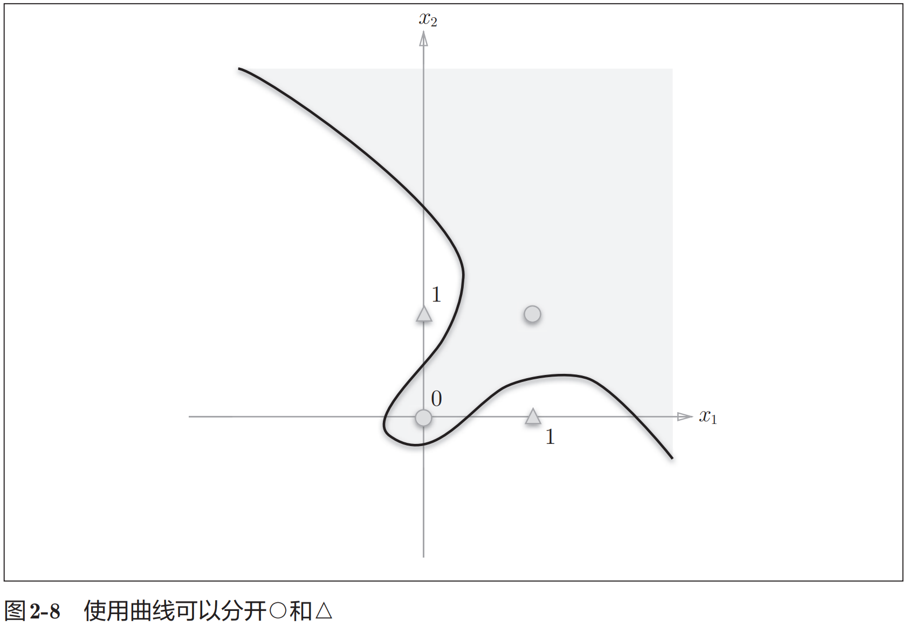

# 感知机

## 基础概念

感知机接收多个输入信号，输出一个信号。感知机的信号只有“传递信号/不传递信号”（1/0）两种取值。

## 示例

图 2-1 是一个接收两个输人信号的感知机的例子。 $x_1 、 x_2$ 是输入信号, $y$ 是输出信号, $w_1 、 w_2$ 是权重。图中的 $O$ 称为 “神经元” 或者 “节点”。输人信号被送往神经元时, 会被分别乘以固定的权重$\left(w_1 x_1 、 w_2 x_2\right)$ 。神经元会计算传送过来的信号的总和，只有当这个总和超过了某个界限值时, 才会输出 1 。这也称为 “神经元被激活” 。这里将这个界限值称为阈值, 用符号 $\theta$ 表示。

感知机的运行原理只有这些! 把上述内容用数学式来表示, 就是式 (2.1)。
$$
y= \begin{cases}0 & \left(w_1 x_1+w_2 x_2 \leqslant \theta\right) \\ 1 & \left(w_1 x_1+w_2 x_2>\theta\right)\end{cases}
$$
感知机的多个输人信号都有各自固有的权重, 这些权重发挥着控制各个信号的重要性的作用。也就是说, 权重越大, 对应该权重的信号的重要性就越高。

## 单层感知机的局限性

单层感知机的局限性就在于它只能表示图2-6这样的由一条直线分割的空间。图2-8这样弯曲的曲线无法用感知机表示。另外，由图2-8这样的曲线分割而成的空间称为非线性空间，由直线分割而成的空间称为线性空间。线性、非线性这两个术语在机器学习领域很常见。

## 多层感知机

感知机的绝妙之处在于它可以“叠加层”（通过叠加层来表示异或门是本节的要点），通过叠加层（加深层），感知机能进行更加灵活的表示（通过2层结构，感知机得以实现异或门）。

多层感知机可以实现比之前见到的电路更复杂的电路。如，进行加法运算的加法器、将二进制转换为十进制的编码器。实际上，使用感知机甚至可以表示计算机！

计算机是处理信息的机器。向计算机中输入一些信息后，它会按照某种既定的方法进行处理，然后输出结果。所谓“按照某种既定的方法进行处理”是指，计算机和感知机一样，也有输入和输出，会按照某个既定的规则进行计算。

理论上可以说2层感知机就能构建计算机。这是因为，已有研究证明，2层感知机（严格地说是激活函数使用了非线性的sigmoid函数的感知机）可以表示任意函数。